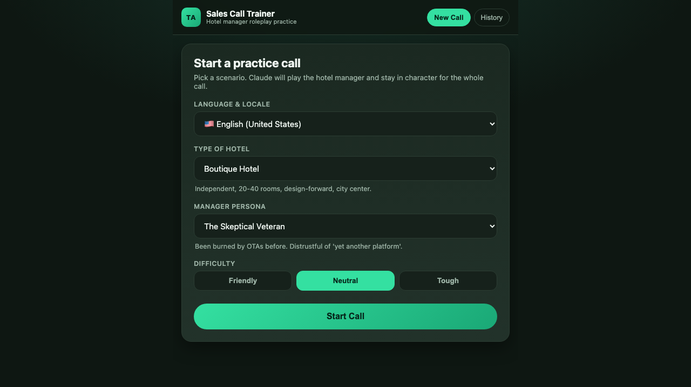
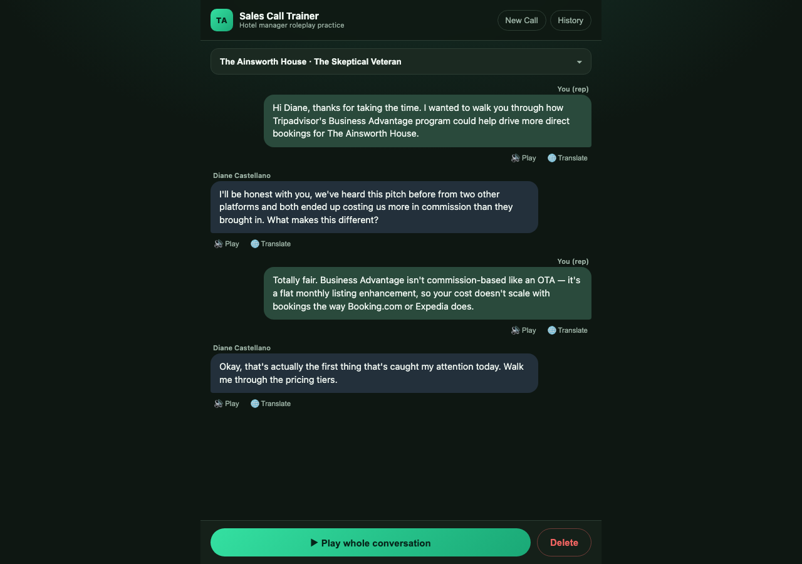

# Sales Call Trainer

A small web app for practicing Tripadvisor-style sales calls with hotel
managers. Claude plays a hotel manager persona and responds in character —
in English or Spanish (Spain, Mexico, Argentina, Colombia) — while you
practice pitching, handling objections, and asking questions, by voice or
by text. Conversations are saved so you can read the transcript back or
have it read aloud to you later.

## Screenshots

| Start a call | History | Transcript |
|---|---|---|
|  |  |  |

## Features

- **Text or voice input**, in English or Spanish, using the browser's
  built-in speech recognition (works best in Chrome/Edge on desktop or
  Android; Safari/iOS support varies).
- **Claude plays the hotel manager** — a specific persona (skeptical
  veteran, data-driven analyst, overwhelmed owner-operator, corporate
  gatekeeper, eager newcomer, review-anxious manager) at a hotel type you
  choose (boutique, luxury resort, business/chain, budget motel, B&B,
  extended-stay), reacting specifically to what you say and occasionally
  asking you questions back, just like a real call.
- **Spanish country locales** — Spain, Mexico, Argentina, Colombia — pick
  the accent/voice used for speech recognition and text-to-speech, and the
  country the invented hotel/manager is set in.
- **Saved conversations** — every call is stored (SQLite) and available
  under "History": read the transcript, replay any single line or the
  whole call out loud, and optionally see an on-demand translation of any
  line.
- **Difficulty levels** — friendly / neutral / tough — controls how easily
  the manager persona is persuaded and how many objections they raise.
- **Record a call as video** — capture the on-screen conversation (and the
  spoken audio, if you share tab audio) and save it as a video file on your
  own machine. See [Recording a call](#recording-a-call) below.

## How voice works

The Claude API doesn't do speech synthesis or recognition itself, so this
app uses the **browser's native Web Speech API** for both:

- **Speech-to-text** (`SpeechRecognition`) captures your spoken line and
  sends the transcribed text to Claude.
- **Text-to-speech** (`speechSynthesis`) reads the manager's reply back to
  you, in a voice matching the chosen locale, and is also used to replay
  saved conversations.

This keeps the app free of extra API keys/costs for voice and works
offline-ish on most phones, but voice quality and language coverage depend
on the voices installed on the device/browser, and `SpeechRecognition`
needs a secure context (HTTPS, or `localhost` during development).

The app avoids picking one of the "novelty" system voices your OS ships
(e.g. macOS's robotic `Albert` or `Zarvox`) and prefers normal-sounding
ones instead. On a Mac, for noticeably better quality than the default
system voice, install one of Apple's higher-quality voices for free: **☰
menu → System Settings → Accessibility → Spoken Content → System Voice →
Manage Voices…**, then download an "Enhanced" or "Premium" voice for your
language (e.g. Ava or Zoe for English) — the app will prefer those
automatically once installed.

Claude is used for the actual intelligence: playing the manager persona,
inventing each scenario (hotel name, manager name, situation), and
on-demand translation of any line between English and Spanish.

## Install on a Mac (no coding experience needed)

These steps get the app running on a Mac from scratch — you don't need to
know how to code, just copy/paste each command into Terminal.

1. **Open Terminal.** Press `Cmd + Space`, type `Terminal`, and press
   `Return`. A window with a text prompt will open — this is where you'll
   paste the commands below, pressing `Return` after each one.

2. **Install Homebrew** (a package installer for Mac). Paste this and press
   `Return`, then follow any on-screen instructions — it may ask for your
   Mac password (nothing will appear on screen as you type it, that's
   normal; just type it and press `Return`):

   ```bash
   /bin/bash -c "$(curl -fsSL https://raw.githubusercontent.com/Homebrew/install/HEAD/install.sh)"
   ```

   When it finishes, it may print 1-2 more commands under "Next steps" —
   copy and run those too, so Homebrew is usable in your Terminal.

3. **Install git and Python** using Homebrew:

   ```bash
   brew install git python
   ```

4. **Download this app.** This puts a copy in your home folder:

   ```bash
   git clone https://github.com/orancummins/translate.git ~/sales-call-trainer
   cd ~/sales-call-trainer
   ```

5. **Run it:**

   ```bash
   ./run.sh
   ```

   The first run takes a minute or two while it sets things up. When it's
   done, it prints `Open http://localhost:5050`.

6. **Open the app.** Go to that address in your web browser (Chrome or Edge
   work best, for the voice features). The first time it loads, it'll ask
   you to paste in a Claude API key — see [Getting an API
   key](#getting-an-api-key) below for where to get one. Paste it in and
   click **Save & Continue**; you only have to do this once.

Whenever you want to use the app again later, open Terminal, run
`cd ~/sales-call-trainer && ./run.sh`, and open
`http://localhost:5050` again. Running `./run.sh` also installs any updates
to the app's dependencies and restarts it if it's already running, so it's
safe to run any time.

### Getting an API key

The app needs a Claude (Anthropic) API key to run the manager roleplay and
translations. This is a separate account from a Claude.ai chat
subscription, and API usage is billed separately (typically a few cents per
practice call).

1. Go to [platform.claude.com/settings/keys](https://platform.claude.com/settings/keys)
   and sign up or log in.
2. In the top-left workspace switcher, pick a workspace (use the "Default
   Workspace" if you don't have others).
3. Click **Create Key**, give it a name, and copy the key it shows you
   (starts with `sk-ant-...`) — it's only shown once.
4. Paste it into the app when prompted (or click the ⚙ icon in the app's
   top bar any time to update it later). The key is saved only in a local
   `.env` file on your own machine — it isn't sent anywhere except
   Anthropic's API.

## Manual setup (for developers)

```bash
pip install -r requirements.txt
python app.py
```

Then open `http://localhost:5050` and paste your API key when prompted, or
set `ANTHROPIC_API_KEY` in your environment or in a `.env` file before
starting the app.

### Configuration

| Env var | Default | Purpose |
|---|---|---|
| `ANTHROPIC_API_KEY` | — | Anthropic API credentials (or paste it into the app on first launch) |
| `CLAUDE_MODEL` | `claude-opus-5` | Model used for the manager roleplay & scenario generation |
| `CLAUDE_TRANSLATE_MODEL` | `claude-haiku-4-5` | Cheaper/faster model used only for the optional line translations |
| `PORT` | `5050` | Port Flask listens on |

## Recording a call

Click **⏺ Record** during a call to save it as a video. Your browser will
ask you to pick what to share — choose **This Tab**, and turn on **Share
tab audio** so the manager's spoken voice is captured, not just the text.
Click **⏹ Stop & Save** (or use the browser's own "Stop sharing" control)
when you're done; the video downloads as a `.webm` file to your Downloads
folder, entirely on your own machine.

This uses the browser's built-in screen-recording APIs
(`getDisplayMedia`/`MediaRecorder`), so it works best in Chrome or Edge.
Safari's support is limited, and it can't capture tab audio at all in some
versions.

## Deploying for "on the go" use

To use voice features from your phone away from your home network, deploy
behind HTTPS (e.g. behind a reverse proxy with a TLS certificate, or a
platform that provides one) — `SpeechRecognition` requires a secure
context in most browsers. Text mode works anywhere.

## Project layout

```
app.py            Flask routes
claude_client.py  Anthropic API calls (scenario generation, manager replies, translation)
personas.py       Hotel types, manager personas, locales, difficulty levels
db.py             SQLite persistence for sessions/messages
templates/         index.html — single-page app shell
static/css/        styling
static/js/         app logic, Web Speech API integration
data/               SQLite database file (gitignored)
```
